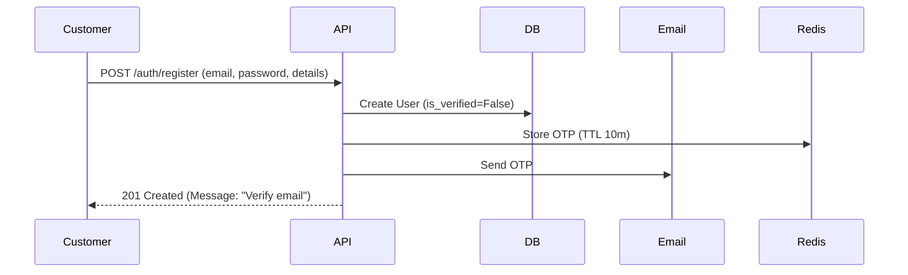
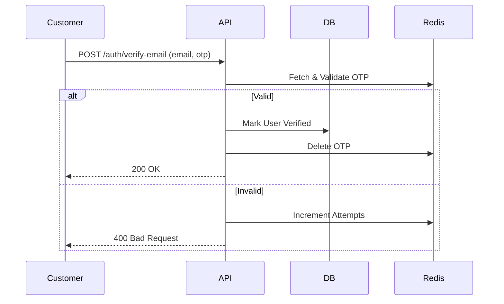
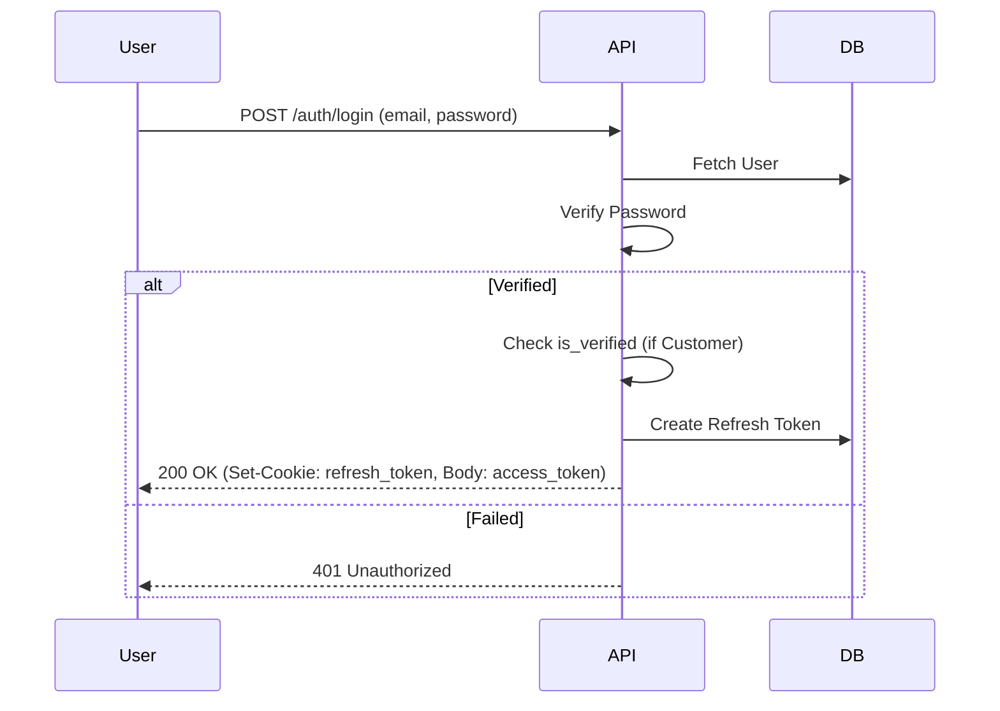
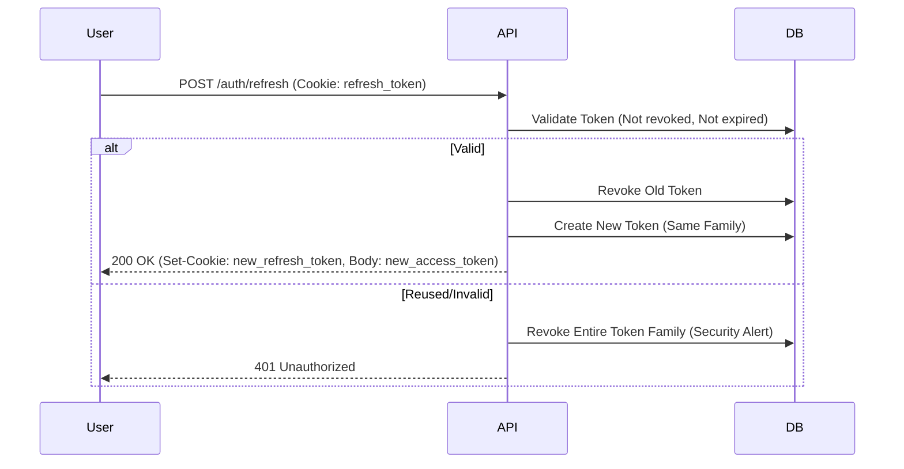

# Authentication & Authorization System Specification

## 1. Overview
This document outlines the architecture for a secure, RESTful authentication and authorization system for **Admin** and **Customer** users. It enforces strict security practices including JWT rotation, httpOnly cookies, OTP verification, and rate limiting.

## 2. User Types & Roles
- **Admin**: Internal staff with elevated privileges.
- **Customer**: End-users requiring email verification before access.

## 2.1 Role-Based Access Control (RBAC)

### Overview
The system supports **dynamic RBAC**, allowing SUPER_ADMIN to create custom roles and permissions at runtime. This provides flexibility for evolving business requirements.

### Default Roles & Hierarchy
1. **SUPER_ADMIN**: Full access to all resources. Can manage roles, permissions, and other admins.
2. **MANAGER**: Can manage operational resources (e.g., Products, Orders) but cannot manage roles or admins.
3. **SUPPORT**: Read-only access to user data and orders. Can perform limited actions (e.g., reset password).
4. **CUSTOMER**: Fixed permissions for profile and own orders. Cannot be modified.

### Default Permissions (Scopes)
Permissions are granular strings in the format `resource:action`.
- `users:read`, `users:write`, `users:delete`
- `roles:read`, `roles:write`, `roles:delete`
- `permissions:read`, `permissions:write`, `permissions:delete`
- `admins:manage`
- `orders:read`, `orders:write`
- `system:config`

### Dynamic Role Management
- **SUPER_ADMIN** can create new roles with custom permission sets.
- Roles are stored in the database with associated permissions.
- Admin users are assigned roles, and permissions are resolved dynamically.
- **CUSTOMER** role is immutable and cannot be modified.

### Enforcement
- **Middleware/Dependency**: `require_permissions()` checks for required scopes in JWT.
- **Permission Resolution**: User permissions = Role permissions + User-specific overrides.
- **Caching**: Permissions cached in Redis for 5 minutes to reduce DB load.

### Default Role-to-Permission Mapping

| Role | Permissions | Modifiable |
| :--- | :--- | :--- |
| SUPER_ADMIN | `*` (All permissions) | No |
| MANAGER | `users:read`, `users:write`, `orders:read`, `orders:write`, `products:read`, `products:write` | Yes |
| SUPPORT | `users:read`, `orders:read` | Yes |
| CUSTOMER | `profile:read`, `profile:write`, `orders:read` | No (Fixed) |

**Note**: SUPER_ADMIN can create additional custom roles beyond these defaults.

### Protected Endpoint Examples

#### Example 1: Admin-Only Endpoint
```python
@router.get("/admin/users")
async def list_all_users(
    current_user: User = Depends(require_permissions(["users:read"]))
):
    # Only accessible by SUPER_ADMIN, MANAGER, SUPPORT
    pass
```

#### Example 2: Super Admin Only
```python
@router.post("/admin/users")
async def create_admin(
    current_user: User = Depends(require_permissions(["admins:manage"]))
):
    # Only SUPER_ADMIN has this permission
    pass
```

#### Example 3: Customer Self-Access
```python
@router.get("/me/profile")
async def get_my_profile(
    current_user: User = Depends(get_current_active_user)
):
    # Any authenticated user (Admin or Customer)
    # Business logic ensures customers only see their own data
    pass
```

## 3. Data Models

### 3.1 User (Base)
*Abstract base model or shared table strategy.*
- `id`: UUID (Primary Key)
- `email`: String (Unique, Indexed)
- `hashed_password`: String
- `is_active`: Boolean (default: True)
- `is_verified`: Boolean (default: False for Customer, True for Admin)
- `role`: Enum (ADMIN, CUSTOMER)
- `created_at`: DateTime
- `updated_at`: DateTime

### 3.2 Customer (Extends User)
- `user_id`: UUID (Foreign Key)
- `first_name`: String
- `last_name`: String
- `phone_number`: String (Optional)

### 3.3 Admin (Extends User)
- `user_id`: UUID (Foreign Key)
- `username`: String (Unique)
- `role_id`: UUID (Foreign Key to Role table)
- `permission_overrides`: JSON (Optional, user-specific permission additions/removals)

### 3.4 Role
- `id`: UUID (Primary Key)
- `name`: String (Unique, e.g., "SUPER_ADMIN", "CUSTOM_ROLE")
- `description`: String (Optional)
- `is_system`: Boolean (True for default roles, False for custom)
- `created_at`: DateTime
- `updated_at`: DateTime

### 3.5 Permission
- `id`: UUID (Primary Key)
- `code`: String (Unique, e.g., "users:read")
- `description`: String (Optional)
- `resource`: String (e.g., "users")
- `action`: String (e.g., "read")
- `created_at`: DateTime

### 3.6 RolePermission (Association Table)
- `role_id`: UUID (Foreign Key)
- `permission_id`: UUID (Foreign Key)
- Primary Key: (`role_id`, `permission_id`)

### 3.7 RefreshToken
- `id`: UUID
- `user_id`: UUID (Foreign Key, Indexed)
- `token_hash`: String (Indexed, for revocation)
- `expires_at`: DateTime
- `created_at`: DateTime
- `revoked`: Boolean (default: False)
- `family_id`: UUID (For rotation tracking)
- `parent_token_id`: UUID (Optional, for chain tracking)

### 3.8 OTP (Redis Storage)
- Key: `otp:{email}:{type}`
- Value: `{ "code": "hashed_code", "attempts": 0 }`
- TTL: 10 minutes

### 3.9 OAuthProvider
- `id`: UUID (Primary Key)
- `name`: String (Unique, e.g., "google", "github")
- `display_name`: String (e.g., "Google", "GitHub")
- `icon`: String (Optional, URL or identifier)
- `client_id`: String
- `client_secret`: String (Encrypted)
- `authorization_url`: String
- `token_url`: String
- `user_info_url`: String
- `is_active`: Boolean
- `created_at`: DateTime
- `updated_at`: DateTime

### 3.10 OAuthAccount
- `id`: UUID (Primary Key)
- `user_id`: UUID (Foreign Key)
- `provider_id`: UUID (Foreign Key)
- `provider_user_id`: String (User ID from provider)
- `email`: String (Email from provider)
- `created_at`: DateTime
- Unique constraint: (`user_id`, `provider_id`)

## 4. OTP Rules
- **Length**: 6 digits (numeric).
- **Expiry**: 10 minutes.
- **Max Attempts**: 3 attempts per OTP.
- **Cooldown**: 60 seconds between resend requests.
- **Lockout**: After 5 failed OTP generation requests in 1 hour, block email for 24 hours.

## 5. Rate Limiter & Caching Design
**Strategy**: Redis-based.

### 5.1 Rate Limiting
**Library**: `fastapi-limiter`.

| Scope | Limit | Action |
| :--- | :--- | :--- |
| Global (Per IP) | 100 req / min | 429 Too Many Requests |
| Login (Per IP) | 5 req / min | Soft lockout (15 min) |
| Login (Per Email) | 5 req / min | Soft lockout (15 min) |
| OTP Request (Per Email) | 3 req / hour | Hard lockout (24 hours if abused) |
| OTP Verify (Per Email) | 5 req / 10 min | Block specific OTP |

### 5.2 Caching Strategy
- **OTP**: Stored exclusively in Redis (Ephemeral).
- **User Permissions**: Cache admin permissions in Redis (`user:{id}:permissions`) for 5 minutes to reduce DB hits on protected routes.
- **Token Blacklist**: Cache revoked tokens (`revoked:{token_hash}`) for quick lookup during middleware checks.


**Abuse Handling**:
- **Soft Lockout**: Temporary block (e.g., 15 mins) after threshold breach.
- **Hard Lockout**: Long-term block (e.g., 24 hours) for repeated offenses.
- **Exponential Backoff**: Response headers include `Retry-After` increasing with repeated failures.

## 6. Auth Flow Diagrams

### 6.1 Registration (Customer)


### 6.2 Email Verification


### 6.3 Login


### 6.4 Token Refresh (Rotation)


## 7. Endpoint Specification

### 7.1 Register Customer
- **URL**: `/auth/register`
- **Method**: `POST`
- **Body**:
  ```json
  {
    "email": "user@example.com",
    "password": "StrongPassword123!",
    "first_name": "John",
    "last_name": "Doe"
  }
  ```
- **Response**: `201 Created`
  ```json
  { "message": "User registered successfully. Please verify your email." }
  ```
- **Error**: `409 Conflict` (Email exists), `422 Validation Error`

### 7.2 Login
- **URL**: `/auth/login`
- **Method**: `POST`
- **Body**: `OAuth2PasswordRequestForm` (username=email, password)
- **Response**: `200 OK`
  - **Body**: `{ "access_token": "...", "token_type": "bearer" }`
  - **Headers**: `Set-Cookie: refresh_token=...; HttpOnly; Secure; SameSite=Lax; Path=/auth/refresh`
- **Error**: `401 Unauthorized` (Invalid credentials), `403 Forbidden` (Email not verified)

### 7.3 Verify Email
- **URL**: `/auth/verify-email`
- **Method**: `POST`
- **Body**:
  ```json
  { "email": "user@example.com", "otp": "123456" }
  ```
- **Response**: `200 OK`
- **Error**: `400 Bad Request` (Invalid/Expired OTP), `404 Not Found`

### 7.4 Refresh Token
- **URL**: `/auth/refresh`
- **Method**: `POST`
- **Cookies**: `refresh_token` (Required)
- **Response**: `200 OK`
  - **Body**: `{ "access_token": "...", "token_type": "bearer" }`
  - **Headers**: `Set-Cookie: refresh_token=...; HttpOnly; Secure; SameSite=Lax; Path=/auth/refresh`
- **Error**: `401 Unauthorized` (Invalid/Revoked token)

### 7.5 Forgot Password
- **URL**: `/auth/forgot-password`
- **Method**: `POST`
- **Body**: `{ "email": "user@example.com" }`
- **Response**: `202 Accepted` (Always return success to prevent email enumeration)
- **Action**: Generate OTP, Send Email.

### 7.6 Reset Password
- **URL**: `/auth/reset-password`
- **Method**: `POST`
- **Body**:
  ```json
  { "email": "user@example.com", "otp": "123456", "new_password": "NewStrongPassword!" }
  ```
- **Response**: `200 OK`
- **Error**: `400 Bad Request` (Invalid OTP)

### 7.7 Resend OTP
- **URL**: `/auth/resend-otp`
- **Method**: `POST`
- **Body**: `{ "email": "user@example.com", "type": "EMAIL_VERIFICATION" }`
- **Response**: `200 OK`
- **Error**: `429 Too Many Requests`

### 7.8 Logout
- **URL**: `/auth/logout`
- **Method**: `POST`
- **Cookies**: `refresh_token`
- **Response**: `200 OK` (Clear Cookie, Revoke Token in DB)

## 7.9 OAuth2 Endpoints (Customer Only)

### 7.9.1 List OAuth Providers
- **URL**: `/auth/oauth/providers`
- **Method**: `GET`
- **Auth**: None (Public)
- **Response**: `200 OK`
  ```json
  {
    "providers": [
      {
        "id": "uuid",
        "name": "google",
        "display_name": "Google",
        "icon": "https://example.com/google-icon.svg",
        "client_id": "client_id_here",
        "authorization_url": "https://accounts.google.com/o/oauth2/v2/auth"
      }
    ]
  }
  ```
- **Note**: `client_secret` is never exposed to frontend

### 7.9.2 OAuth Callback
- **URL**: `/auth/oauth/callback`
- **Method**: `POST`
- **Body**:
  ```json
  {
    "provider_name": "google",
    "code": "authorization_code_from_provider",
    "redirect_uri": "https://frontend.com/callback"
  }
  ```
- **Response**: `200 OK`
  ```json
  {
    "access_token": "...",
    "token_type": "bearer",
    "user": {
      "id": "uuid",
      "email": "user@example.com",
      "is_new": true
    }
  }
  ```
  - **Headers**: `Set-Cookie: refresh_token=...; HttpOnly; Secure`
- **Flow**:
  1. Backend exchanges `code` for access token with provider
  2. Fetches user info from provider
  3. Creates user if doesn't exist (auto-verified)
  4. Links OAuth account to user
  5. Generates JWT tokens
- **Error**: `400 Bad Request` (Invalid code), `404 Not Found` (Provider not found)

## 7.10 Role Management Endpoints

### 7.10.1 Create Role
- **URL**: `/admin/roles`
- **Method**: `POST`
- **Auth**: Requires `roles:write` permission (SUPER_ADMIN only)
- **Body**:
  ```json
  {
    "name": "CUSTOM_ROLE",
    "description": "Custom role for specific team",
    "permission_ids": ["uuid1", "uuid2", "uuid3"]
  }
  ```
- **Response**: `201 Created`
  ```json
  {
    "id": "uuid",
    "name": "CUSTOM_ROLE",
    "description": "Custom role for specific team",
    "is_system": false,
    "permissions": [...]
  }
  ```
- **Error**: `403 Forbidden`, `409 Conflict` (Role name exists)

### 7.10.2 List Roles
- **URL**: `/admin/roles`
- **Method**: `GET`
- **Auth**: Requires `roles:read` permission
- **Response**: `200 OK`
  ```json
  {
    "roles": [
      {
        "id": "uuid",
        "name": "SUPER_ADMIN",
        "is_system": true,
        "permissions_count": 15
      }
    ]
  }
  ```

### 7.10.3 Get Role Details
- **URL**: `/admin/roles/{role_id}`
- **Method**: `GET`
- **Auth**: Requires `roles:read` permission
- **Response**: `200 OK`
  ```json
  {
    "id": "uuid",
    "name": "MANAGER",
    "description": "...",
    "is_system": true,
    "permissions": [
      {"id": "uuid", "code": "users:read", "description": "..."}
    ]
  }
  ```

### 7.10.4 Update Role
- **URL**: `/admin/roles/{role_id}`
- **Method**: `PUT`
- **Auth**: Requires `roles:write` permission
- **Body**:
  ```json
  {
    "description": "Updated description",
    "permission_ids": ["uuid1", "uuid2"]
  }
  ```
- **Response**: `200 OK`
- **Error**: `403 Forbidden` (Cannot modify system roles), `404 Not Found`

### 7.10.5 Delete Role
- **URL**: `/admin/roles/{role_id}`
- **Method**: `DELETE`
- **Auth**: Requires `roles:delete` permission
- **Response**: `204 No Content`
- **Error**: `403 Forbidden` (Cannot delete system roles or roles in use)

## 7.11 Permission Management Endpoints

### 7.11.1 Create Permission
- **URL**: `/admin/permissions`
- **Method**: `POST`
- **Auth**: Requires `permissions:write` permission (SUPER_ADMIN only)
- **Body**:
  ```json
  {
    "code": "products:export",
    "description": "Export product data",
    "resource": "products",
    "action": "export"
  }
  ```
- **Response**: `201 Created`
- **Error**: `409 Conflict` (Permission code exists)

### 7.11.2 List Permissions
- **URL**: `/admin/permissions`
- **Method**: `GET`
- **Auth**: Requires `permissions:read` permission
- **Query Params**: `?resource=users` (optional filter)
- **Response**: `200 OK`
  ```json
  {
    "permissions": [
      {
        "id": "uuid",
        "code": "users:read",
        "resource": "users",
        "action": "read"
      }
    ]
  }
  ```

### 7.11.3 Delete Permission
- **URL**: `/admin/permissions/{permission_id}`
- **Method**: `DELETE`
- **Auth**: Requires `permissions:delete` permission
- **Response**: `204 No Content`
- **Error**: `403 Forbidden` (Cannot delete if assigned to roles)

## 7.12 Admin User Management

### 7.12.1 Assign Role to Admin
- **URL**: `/admin/users/{user_id}/role`
- **Method**: `PUT`
- **Auth**: Requires `admins:manage` permission
- **Body**:
  ```json
  {
    "role_id": "uuid"
  }
  ```
- **Response**: `200 OK`
- **Error**: `403 Forbidden`, `404 Not Found`

### 7.12.2 Override Admin Permissions
- **URL**: `/admin/users/{user_id}/permissions`
- **Method**: `PUT`
- **Auth**: Requires `admins:manage` permission
- **Body**:
  ```json
  {
    "add_permissions": ["users:delete"],
    "remove_permissions": ["orders:write"]
  }
  ```
- **Response**: `200 OK`
- **Error**: `403 Forbidden`

## 8. Security Checklist
- [ ] **Password Hashing**: Use `bcrypt` (or `argon2`).
- [ ] **Token Storage**: Access Token in memory (client-side), Refresh Token in HttpOnly, Secure Cookie.
- [ ] **Token Rotation**: Refresh tokens are single-use. Reuse detection triggers family revocation.
- [ ] **CSRF**: Necessary if Access Token is also in cookie, but since Access Token is Bearer header, CSRF on Refresh endpoint is mitigated by Path restriction and SameSite=Lax/Strict.
- [ ] **Brute Force**: Rate limiting on Login and OTP endpoints.
- [ ] **OTP Security**:
    - Randomly generated (CSPRNG).
    - Hashed in database (prevent leakage if DB compromised).
    - Short expiry (10 mins).
- [ ] **Account Enumeration**: Generic messages for "Forgot Password" and "Login" (where possible, though Login usually reveals existence by error type, we can mask it).
- [ ] **SQL Injection**: Use ORM (SQLModel) properly.

## 9. Implementation Notes
- **JWT Strategy**:
    - Access Token: 15 minutes expiry. Contains `sub` (user_id), `role`, `permissions`.
    - Refresh Token: 7 days expiry. Opaque or JWT. Stored in DB for state management.
- **Idempotency**: Use `Idempotency-Key` header for critical state-changing operations if network is unreliable (optional for this scope but good practice).
- **Database**:
    - Index `email` on User.
    - Index `token_hash` on RefreshToken.
    - Index `email` on OTP.
- **Error Codes**:
    - `AUTH_001`: Invalid Credentials
    - `AUTH_002`: Account Not Verified
    - `AUTH_003`: Token Expired
    - `AUTH_004`: OTP Invalid
